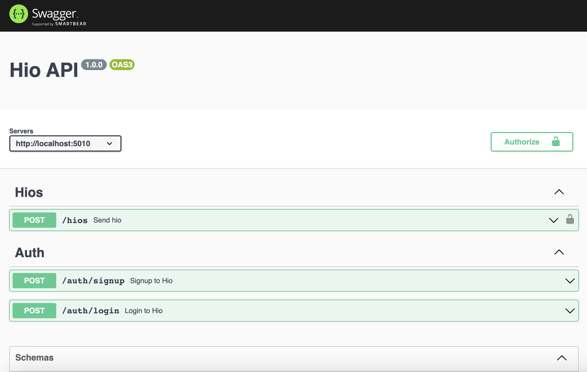

# Setup

Before we can send a "HIO" to someone this project has to run.

## Setup the environment

We will begin with running `npm i` in the terminal:

```bash
npm install
```

This installed all the project's dependency but also it created an `openapi.json` file for each of the services and the gateway, and regenerated the services' clients

Now, lets start with configuring the IDE. This will enable us to run all the services at once (two services and one gateway, to be precise...)

## Run the project

### VSCode

> it is recommended to use _VSCode_ in this workshop. But if you are using another IDE everything is fine. See the instructions on ["Other IDEs"](#other-ides) after this section

#### Setup the launch

Create a new folder `.vscode` at the root of the project

Create a new file `tasks.json` inside the folder and copy to following code into the file:

```json
{
  "version": "2.0.0",
  "tasks": [
    {
      "label": "docker-compose: up",
      "command": "docker-compose",
      "type": "process",
      "args": ["-f", "${workspaceFolder}/docker-compose.yml", "up", "-d"]
    },
    {
      "label": "docker-compose: down",
      "command": "docker-compose",
      "type": "process",
      "args": ["-f", "${workspaceFolder}/docker-compose.yml", "down", "-d"]
    }
  ]
}
```

<sup>`tasks.json`</sup>

Create another file `launch.json` inside the folder and copy the following code:

```json
{
  // Use IntelliSense to learn about possible attributes.
  // Hover to view descriptions of existing attributes.
  // For more information, visit: https://go.microsoft.com/fwlink/?linkid=830387
  "version": "0.2.0",
  "configurations": [
    {
      "type": "node",
      "request": "launch",
      "name": "Auth",
      "skipFiles": ["<node_internals>/**"],
      "program": "${workspaceFolder}/services/auth/index.ts",
      "preLaunchTask": "npm: prepare - services/auth",
      "outFiles": ["${workspaceFolder}/**/*.js"]
    },
    {
      "type": "node",
      "request": "launch",
      "name": "Hios",
      "skipFiles": ["<node_internals>/**"],
      "program": "${workspaceFolder}/services/hios/index.ts",
      "preLaunchTask": "npm: prepare - services/hios",
      "outFiles": ["${workspaceFolder}/**/*.js"]
    },
    {
      "type": "node",
      "request": "launch",
      "name": "Hio Api",
      "skipFiles": ["<node_internals>/**"],
      "program": "${workspaceFolder}/gateways/hio-api/index.ts",
      "preLaunchTask": "npm: prepare - gateways/hio-api",
      "outFiles": ["${workspaceFolder}/**/*.js"]
    }
  ],
  "compounds": [
    {
      "name": "Launch All",
      "configurations": ["Auth", "Hios", "Hio Api"],
      "preLaunchTask": "docker-compose: up",
      "postDebugTask": "docker-compose: down",
      "stopAll": true
    }
  ]
}
```

<sup>`launch.json`</sup>

These files declare the tasks and actions to execute while running this project.

It starts with `docker-compose up` continues with running all the services and when stopping the services, `docker-compose down` is executed.

#### Run the project

Go to "Run and Debug" sidebar or use `⇧⌘D` shortcut to show the sidebar

Pick **"Launch All"** At the top dropdown

</img>

Click on **"play"**

Wait to all three projects to run

### Other IDEs

> You can skip this section if you are using _VSCode_

Open the terminal and run

```bash
npm start --w services/auth
```

Open another terminal and run

```bash
npm start --w services/hios
```

Open a third (and last) terminal and run

```bash
npm start --w gateways/hio-api
```

All three projects should be running now

## Swagger

As part of the gateway, swagger ui was setup so we can navigate and see the hio-api routes

Go to [http://localhost:5010/docs](http://localhost:5010/docs) in your browser.

You should see the following page:



Yay 😄

You are ready to move on and [Send a HIO >>](./002%20send-a-hio.md)
