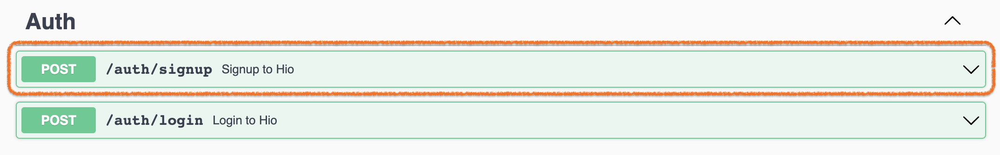
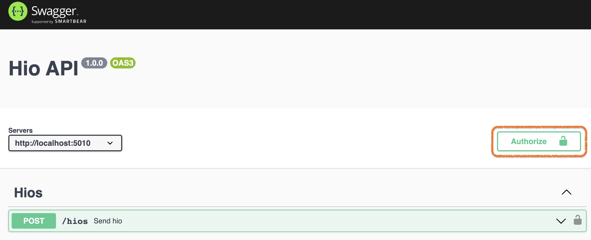
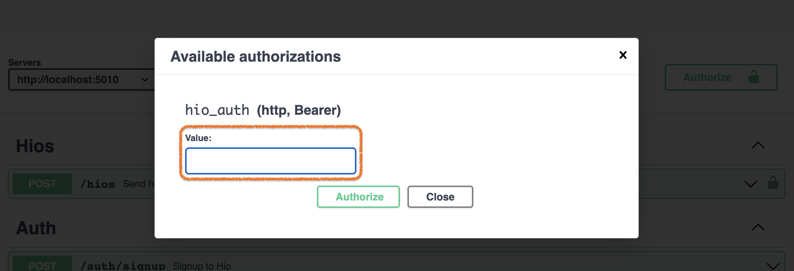

# Send a HIO

Before we send a HIO, we should create a user and get a token to use in the authorization header of the request.

## Create a user

In the swagger UI, click on `[POST] /auth/signup` to expand it.



Now, click on **_"Try it out"_** button and then on **_"Execute"_**.

The Execute button sends a request to hio-api gateway and a new user is created in the database. After the request has finished the response should be shown if you scroll down a bit.

An example for the response:

```json
{
  "id": "d6076ac5-7b11-48d5-b648-a54478806b76"
  "name": "john.doe"
  "token": "TOP SECRET"
}
```

Copy the value from the token, we need it to send a HIO!

## Setup Authentication

The send HIO route is secure, which means we have to pass an authentication to the route which indeicates a valid user is sending the request.

In this case the route is authenticated with a JWT token which should be passed via the "Authorization" header of the request.

Luckily, it is all configured in the generated openapi so swagger can give us a convinient way to send the token with the request.

Click on the **_"Authorize"_** button



In the window that opens, paste the token that was copied on the previous step to the "value" text-box,

> If you don't have the token from the previous step, you can execute the `POST /auth/login` route to get the user's token



Click on **_"Authorize"_** and then on **_"Close"_**

See the lock on the **_"Authorize"_** button, it is now "locked" 🔒 and is not "unlocked" 🔓 as it was before, this means the "Authorization" header will be sent in all the requests to secure routes like the "send HIO".

You can identify which route is secure by the lock on the right. See the lock on the right of the "send HIO" route, this route is secure.

## Send a HIO

We are ready to send someone a HIO, (this will not send anything to anyone but lets imagine it will...)

Click on `[POST] /hios` to expand this route options.

Click on **_"Try it out"_** button, and then click on **_"Execute"_**

TADA 🎉!

Someone got a HIO from you!

You can see the details of the sent HIO in the response details, like the id of the HIO and the time it was created

Example for a response

```json
{
  "id": "25c8b873-7bd7-4357-8aa6-20373541a90b",
  "userId": "c0960391-8d4f-4196-8388-bdb64a40f921",
  "targetUserId": "0a81be47-451f-49f3-8f07-29461cbda3f5",
  "createdAt": "2022-12-05T15:31:31.791Z"
}
```

---

Till here we setup and run the project, now lets move on and expand this project's capabilities with the [First Assignment >>]()
